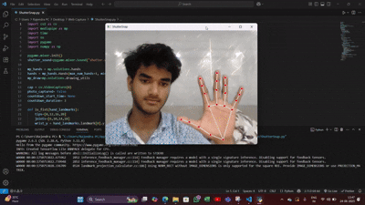

# ShutterSnap 

A Python + OpenCV project that lets you capture a photo just by showing a **Fist Gesture**.

This real-time gesture recognition tool uses :

**MediaPipe for hand tracking**

**OpenCV for computer vision (via webcam)**

**Pygame for audio feedback**


## Features
-> Detects your fist to trigger a 3-second countdown

-> Clicks a photo with shutter sound and flash

-> Saves the image automatically with timestamp
## Demo

Demo GIF

<p align="center">
  
</p>


## Installation

1) Install all dependencies with pip
2) Run the python file
.
.
.
.
.
OR See Below
.
.
.
.
.
.


```bash
  npm install -r requirements.txt
  python ShutterSnap.py
```
    
